# 🏆 GOLDEN TOURNAMENT 공식 전체 사용 설명서

> **"조기 탈락 없는 공정한 스위스 균등 노출과 실시간 Elo 래더, 골든 파이널 4강 챔피언십이 결합된 차세대 유튜브 영상/음악 토너먼트"**

---

## 📑 목차
1. [시스템 소개 및 핵심 차별점](#1-시스템-소개-및-핵심-차별점)
2. [준비 단계: 설정 및 커스터마이징 (Setup View)](#2-준비-단계-설정-및-커스터마이징-setup-view)
   - [2.1 메인 설정 화면 구조](#21-메인-설정-화면-구조)
   - [2.2 후보 영상 관리 & 재생 점검](#22-후보-영상-관리--재생-점검)
   - [2.3 진행 코스 선택 (퀵 / 표준 / 마스터)](#23-진행-코스-선택-퀵--표준--마스터)
   - [2.4 치지직(CHZZK) 실시간 방송 연동 설정](#24-치지직chzzk-실시간-방송-연동-설정)
   - [2.5 테마 & 방송 송출용 글씨/화면 설정](#25-테마--방송-송출용-글씨화면-설정)
3. [1단계: 스위스 균등 노출 (Fair Swiss Phase)](#3-1단계-스위스-균등-노출-fair-swiss-phase)
   - [3.1 듀얼 플레이어 인터페이스 & 조작](#31-듀얼-플레이어-인터페이스--조작)
   - [3.2 투표 조작 및 단축키 안내](#32-투표-조작-및-단축키-안내)
   - [3.3 직전 투표 취소 (Undo) 및 무승부 스킵](#33-직전-투표-취소-undo-및-무승부-스킵)
   - [3.4 실시간 Elo 순위표 확인](#34-실시간-elo-순위표-확인)
4. [2단계: 실시간 Elo 라이벌 래더 (Elo Ladder Phase)](#4-2단계-실시간-elo-라이벌-래더-elo-ladder-phase)
   - [4.1 실시간 승률 예측 게이지 시각화](#41-실시간-승률-예측-게이지-시각화)
   - [4.2 치지직 시청자 채팅 투표 & 다수결 반영](#42-치지직-시청자-채팅-투표--다수결-반영)
   - [4.3 상위 1~4위 즉시 4강전 진출](#43-상위-14위-즉시-4강전-진출)
5. [3단계: 골든 파이널 4강 토너먼트 (Golden Final 4)](#5-3단계-골든-파이널-4강-토너먼트-golden-final-4)
   - [5.1 4강 대진표 트리 (1위 vs 4위, 2위 vs 3위)](#51-4강-대진표-트리-1위-vs-4위-2위-vs-3위)
   - [5.2 4강전 및 최종 결승전(Grand Final) 연출](#52-4강전-및-최종-결승전grand-final-연출)
6. [4단계: 명예의 전당 & 인터랙티브 티어표 (Result & Tier Maker)](#6-4단계-명예의-전당--인터랙티브-티어표-result--tier-maker)
   - [6.1 최종 챔피언 우승 헌정 세션](#61-최종-챔피언-우승-헌정-세션)
   - [6.2 마노사바 스타일 드래그 & 드롭 티어표](#62-마노사바-스타일-드래그--드롭-티어표)
   - [6.3 결과 순위표 텍스트 복사 및 고화질 PNG 이미지 다운로드](#63-결과-순위표-텍스트-복사-및-고화질-png-이미지-다운로드)
7. [스트리머 특화 기능 및 성능 최적화](#7-스트리머-특화-기능-및-성능-최적화)

---

## 1. 시스템 소개 및 핵심 차별점

기존 이상형 월드컵은 **1라운드에서 강자끼리 맞붙으면 패배한 명곡이 조기 탈락**하여 다시는 볼 수 없는 치명적인 구조적 한계가 있었습니다.

**GOLDEN TOURNAMENT**는 이 문제를 해결하기 위해 다음의 4단계 하이브리드 토너먼트 시스템을 도입했습니다:

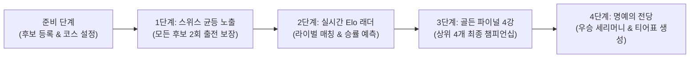

- **조기 탈락 Zero**: 모든 후보가 최소 2회 이상 출전 기회를 가집니다.
- **실시간 Elo 레이팅**: 매치 결과에 따라 수학적 Elo 공식에 의해 레이팅이 갱신됩니다.
- **Zero-Lag 60FPS**: YouTube Iframe 영구 재활용 풀링 기법으로 페이지 메모리 누수 및 프레임 드랍을 차단했습니다.

---

## 2. 준비 단계: 설정 및 커스터마이징 (Setup View)

토너먼트 시작 전 참가 후보들을 관리하고, 코스를 선택하며, 방송 연동 및 화면 설정을 완료하는 단계입니다.

### 2.1 메인 설정 화면 구조

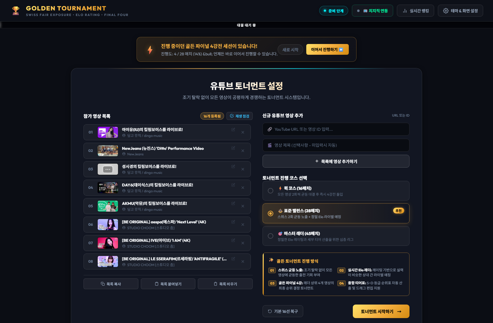

1. **상단 글로벌 헤더**:
   - 현재 토너먼트 진행 단계 뱃지 (`준비 단계`)
   - `📺 치지직 연동` 바로가기 버튼
   - `📊 실시간 랭킹` 조회 버튼
   - `⚙️ 테마 & 화면 설정` 다이얼로그 버튼
2. **세션 복원 배너**: 이전에 진행 중이던 토너먼트가 있을 경우 상단에 노란색 번개 알림 배너가 표시되며 `이어서 진행하기 ⏩` 버튼으로 즉시 복구할 수 있습니다.
3. **좌측 영역 (참가 영상 목록)**: 현재 등록된 유튜브 후보 목록 확인, 수정, 삭제, 임베드 재생 점검.
4. **우측 영역 (설정 컨트롤)**: 신규 유튜브 영상 추가 폼, 토너먼트 코스 선택, 진행 방식 안내, 토너먼트 시작 버튼.

---

### 2.2 후보 영상 관리 & 재생 점검

- **영상 추가**: YouTube 영상의 URL(예: `https://www.youtube.com/watch?v=...`) 또는 11자리 영상 고유 ID를 입력창에 넣고 `+ 목록에 영상 추가하기`를 클릭합니다. (제목 미입력 시 유튜브 메타데이터 자동 추출)
- **개별 관리**: 후보 목록 항목의 ✏️(수정) 아이콘으로 제목 변경, ✕(삭제) 아이콘으로 개별 제거가 가능합니다.
- **재생 점검 기능**: `재생 점검` 버튼을 누르면 모든 후보의 외부 재생 차단(오류 150/101) 및 삭제 여부를 백그라운드에서 사전 스캔하여 방송 사고를 미연에 방지합니다.
- **하단 편의 액션**:
  - `📋 목록 복사`: 현재 구성된 영상 리스트를 텍스트 클립보드로 복사.
  - `📥 목록 붙여넣기`: 공유받은 목록을 한 번에 일괄 추가.
  - `🗑️ 목록 비우기`: 전체 후보 초기화.
  - `🔄 기본 16선 복구`: 엄선된 기본 유튜브 16선으로 즉시 리셋.

---

### 2.3 진행 코스 선택 (퀵 / 표준 / 마스터)

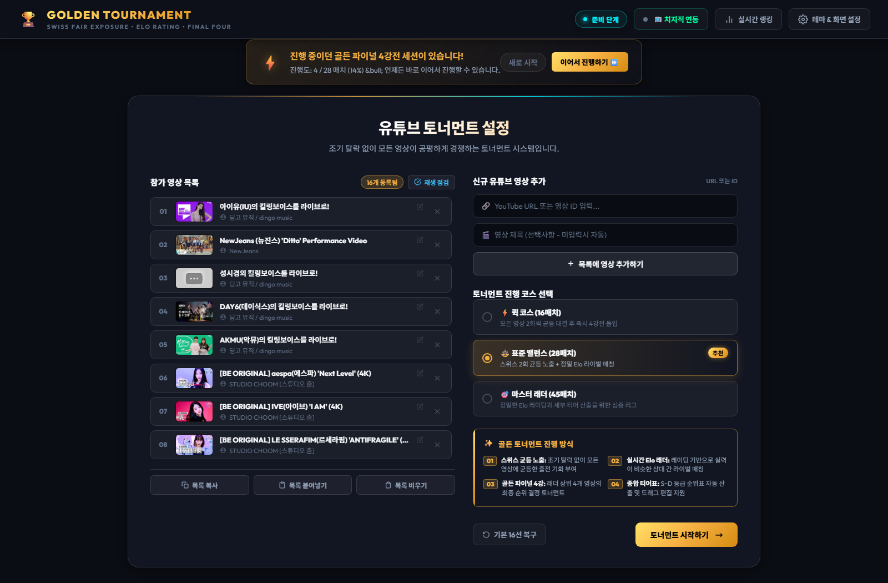

참가자 수($N$)에 따라 최적의 매치 수가 자동 연산되며, 3가지 모드 중 선택할 수 있습니다:

| 코스 종류 | 16선 기준 매치 수 | 특징 및 권장 상황 |
| :--- | :---: | :--- |
| ⚡ **퀵 코스** | **16매치** | 모든 영상 2회 균등 대결 후 즉시 4강전 돌입 (빠른 진행용) |
| ⚖️ **표준 밸런스** *(추천)* | **28매치** | 스위스 2회 균등 노출 + 정밀 Elo 라이벌 매칭 (가장 완성도 높은 표준 코스) |
| 🎯 **마스터 래더** | **45매치** | 세부 티어 산출과 실시간 라이벌 대결을 깊이 있게 즐기는 심층 리그 |

---

### 2.4 치지직(CHZZK) 실시간 방송 연동 설정

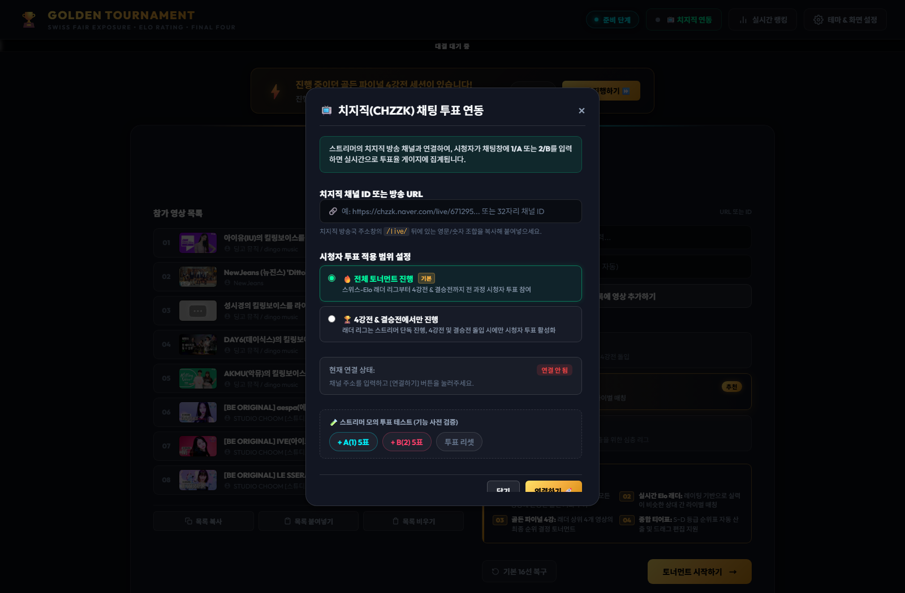

인터넷 방송 스트리머를 위한 치지직(CHZZK) 공식 채팅 연동 기능입니다:
1. 헤더의 `📺 치지직 연동` 버튼을 클릭합니다.
2. 치지직 채널 고유 ID(32자리 영문/숫자 해시값)를 입력합니다.
3. 연동 범위를 선택합니다:
   - **전체 라운드 적용**: 1단계 스위스부터 결승까지 모든 매치에서 시청자 투표 진행.
   - **4강전 & 결승전 전용**: 래더 리그는 스트리머 단독 진행 후, 4강부터 시청자 투표 활성화.
4. `연결하기` 버튼을 누르면 실시간 웹소켓으로 시청자의 `1/A` 또는 `2/B` 채팅이 즉시 투표로 집계됩니다.

---

### 2.5 테마 & 방송 송출용 글씨/화면 설정

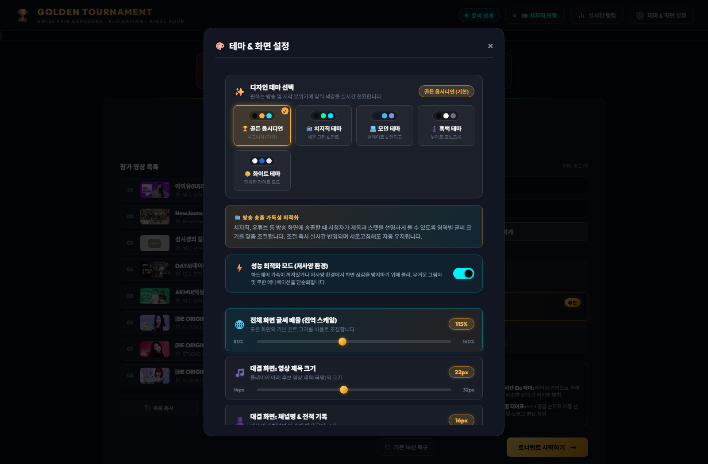

OBS/방송 송출 환경이나 모니터 크기에 맞게 1픽셀 단위로 UI를 조절할 수 있습니다:
- **5가지 디자인 테마**:
  - 🏆 **골든 옵시디언**: 프리미엄 골드 & 다크 옵시디언 (기본)
  - 🟢 **치지직 테마**: 네온 그린 포인트의 사이버펑크 룩
  - 🌌 **모던 테마**: 딥 바이올렛 & 인디고 네온
  - ⚪ **흑백 테마**: 미니멀 모노크롬 감성
  - ☀️ **화이트 테마**: 깔끔하고 산뜻한 고대비 라이트 모드
- **방송 송출용 가독성 조절**:
  - **전체 화면 배율**: 90% ~ 140%까지 확대/축소
  - **항목별 폰트 크기 슬라이더**: 대결 제목, 채널명, ELO 뱃지, 투표 버튼 크기 등 독립 조절
  - **원클릭 최적화 프리셋**: `치지직/유튜브 최적 권장값` 버튼 클릭 시 방송 송출에 가장 이상적인 크기로 즉시 세팅

---

## 3. 1단계: 스위스 균등 노출 (Fair Swiss Phase)

토너먼트 시작 시 모든 후보가 최소 2회씩 의무 출전하는 공정 배분 단계입니다.

### 3.1 듀얼 플레이어 인터페이스 & 조작

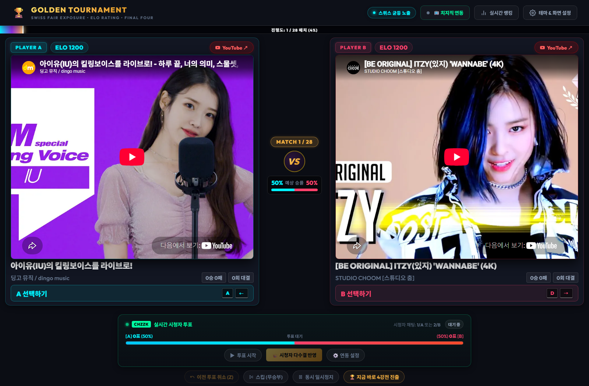

- **좌측(PLAYER A, Cyan)** vs **우측(PLAYER B, Rose)**: 두 영상의 동시/단독 재생 지원.
- **영상 동기화 & 재생**: 영상 내 클릭 또는 하단 `동시 일시정지` 버튼으로 듀얼 컨트롤.
- **외부 재생 제한 대응**: 영상 제작자의 보안 정책으로 외부 임베드가 막힌 경우 `YouTube에서 직접 듣기 ↗` 버튼이 활성화되어 새 탭에서 즉시 감상할 수 있습니다.

---

### 3.2 투표 조작 및 단축키 안내

마우스 클릭 또는 키보드 단축키로 신속하게 투표할 수 있습니다:

| 조작 키 | 대상 | 동작 설명 |
| :---: | :---: | :--- |
| <kbd>A</kbd> 또는 <kbd>←</kbd> | **PLAYER A** | 좌측 영상 투표 및 승리 확정 |
| <kbd>D</kbd> 또는 <kbd>→</kbd> | **PLAYER B** | 우측 영상 투표 및 승리 확정 |
| <kbd>Z</kbd> 또는 <kbd>Ctrl</kbd>+<kbd>Z</kbd> | **이전 투표 취소** | 직전 매치 결과 롤백 (실수 복구) |
| <kbd>Space</kbd> | **일시정지** | 영상 재생 토글 |

---

### 3.3 직전 투표 취소 (Undo) 및 무승부 스킵

- **↺ 이전 투표 취소 (Z)**: 투표 즉시 Elo 점수 갱신 및 히스토리가 기록되며, 오클릭 발생 시 하단의 `이전 투표 취소 (Z)` 버튼을 누르면 직전 상태로 완벽히 복원됩니다.
- **⏭️ 스킵 (무승부)**: 두 영상 모두 우열을 가리기 힘들 때 승패 기록 없이 다음 매치로 넘어갑니다.

---

### 3.4 실시간 Elo 순위표 확인

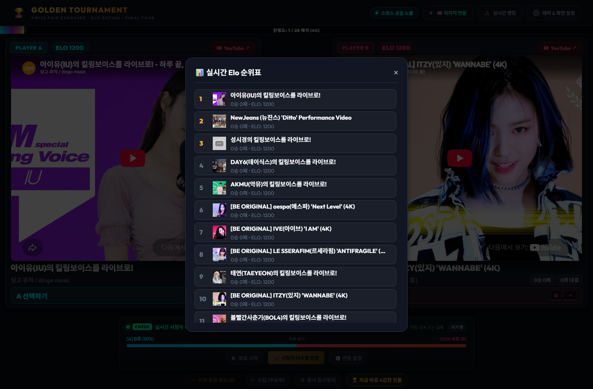

대결 도중 헤더의 `📊 실시간 랭킹` 버튼을 누르면 현재까지의 1~16위 전체 순위, 실시간 ELO 점수, 승/패 전적을 모달 창에서 실시간으로 확인할 수 있습니다.

---

## 4. 2단계: 실시간 Elo 라이벌 래더 (Elo Ladder Phase)

스위스 단계가 끝나면, 누적된 실시간 레이팅을 바탕으로 **Elo 점수가 비슷한 라이벌끼리 맞붙는 심층 래더**가 펼쳐집니다.

### 4.1 실시간 승률 예측 게이지 시각화

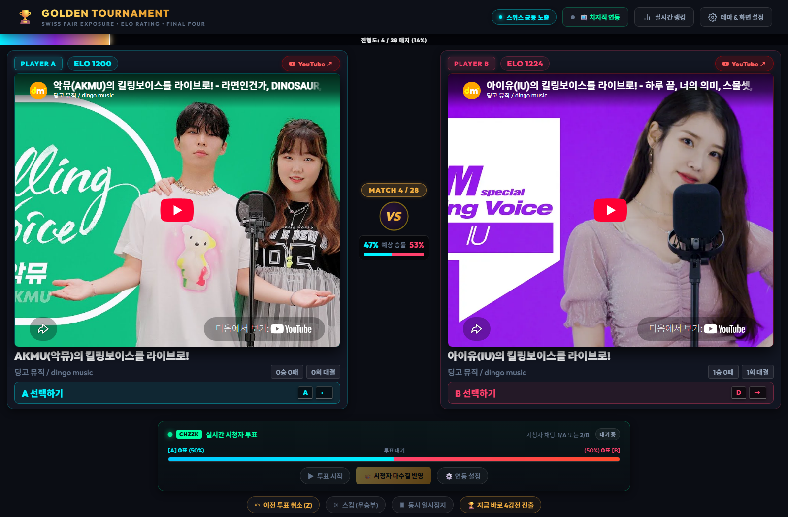

- 두 후보의 현재 Elo 차이를 기반으로 **예상 승률(%)이 실시간으로 연산**되어 중앙 디바이더 게이지에 시각화됩니다.
- 언더독(약자)이 승리할 경우 더 높은 Elo 점수를 획득하는 역전의 묘미를 실시간으로 체감할 수 있습니다.

---

### 4.2 치지직 시청자 채팅 투표 & 다수결 반영

하단의 치지직 시청자 투표 패널에서:
- `▶ 투표 시작`: 실시간 채팅 투표 집계 활성화.
- 시청자가 `1` 또는 `A`, `2` 또는 `B`를 채팅창에 입력하면 실시간 득표수와 점유율이 60FPS 애니메이션 게이지로 반영됩니다.
- `👑 시청자 다수결 반영`: 방송 진행자가 시청자 다수결 결과에 따라 원클릭으로 해당 후보에게 자동 투표할 수 있습니다.

---

### 4.3 상위 1~4위 즉시 4강전 진출

래더 진행 중 언제라도 하단의 **`🏆 지금 바로 4강전 진출`** 버튼을 누르면 현재 시점의 실시간 순위 상위 1~4위 후보를 확정하고 즉시 골든 파이널 4강 토너먼트로 진입할 수 있습니다.

---

## 5. 3단계: 골든 파이널 4강 토너먼트 (Golden Final 4)

스위스-Elo 래더 리그를 통과한 최상위 4개 명곡의 최종 우승 결정전입니다.

### 5.1 4강 대진표 트리 (1위 vs 4위, 2위 vs 3위)

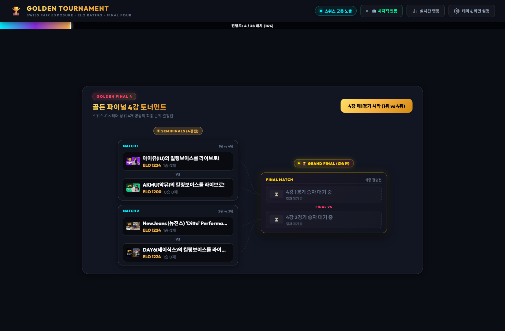

- **공정한 시드 배정**: 1위 vs 4위 (매치 1), 2위 vs 3위 (매치 2)로 대진표가 자동 편성됩니다.
- 승리한 후보 슬롯에서 결승전 슬롯으로 **황금 네온 베지어 곡선(Bezier Path)**이 연결되어 결승 진출을 역동적으로 시각화합니다.
- 상단 우측의 `4강 제1경기 시작` ➔ `4강 제2경기 시작` ➔ `결승전 시작하기` 버튼을 차례로 누르며 진행합니다.

---

### 5.2 4강전 및 최종 결승전(Grand Final) 연출

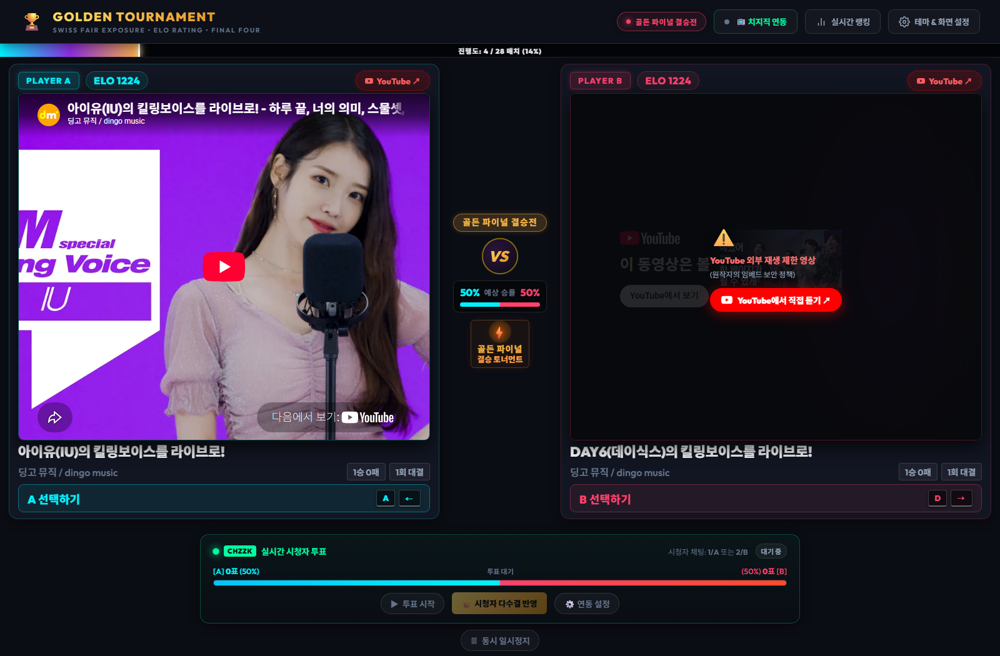

- **골든 파이널 전용 뱃지 & 인터페이스**: 4강 및 결승전 전용 골든 테두리와 승패 표시가 적용됩니다.
- 결승전 투표가 완료되는 순간 대망의 명예의 전당 화면으로 자동 전환됩니다.

---

## 6. 4단계: 명예의 전당 & 인터랙티브 티어표 (Result & Tier Maker)

토너먼트의 모든 경기가 종료되면 최종 우승 영상 헌정 세션과 전체 참가곡 종합 티어표가 열립니다.

### 6.1 최종 챔피언 우승 헌정 세션

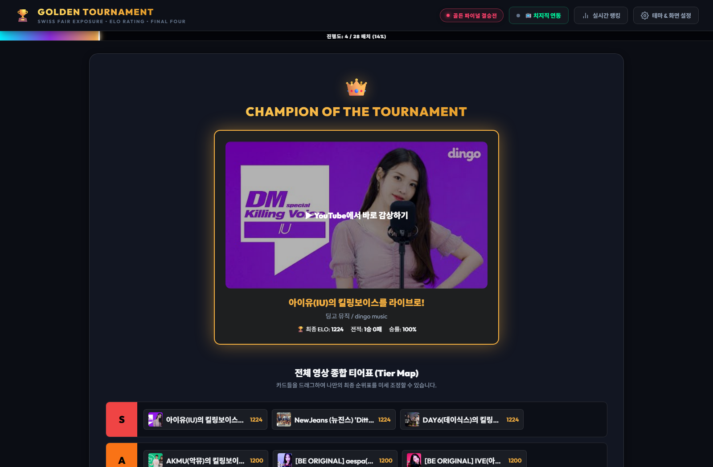

- 황금 왕관과 함께 최종 챔피언 영상의 썸네일, 공식 채널명, 최종 ELO 레이팅, 최종 전적, 승률(%)이 전시됩니다.
- `▶ YouTube에서 바로 감상하기` 버튼으로 챔피언 곡을 공식 YouTube 링크에서 풀버전으로 감상할 수 있습니다.

---

### 6.2 마노사바 스타일 드래그 & 드롭 티어표

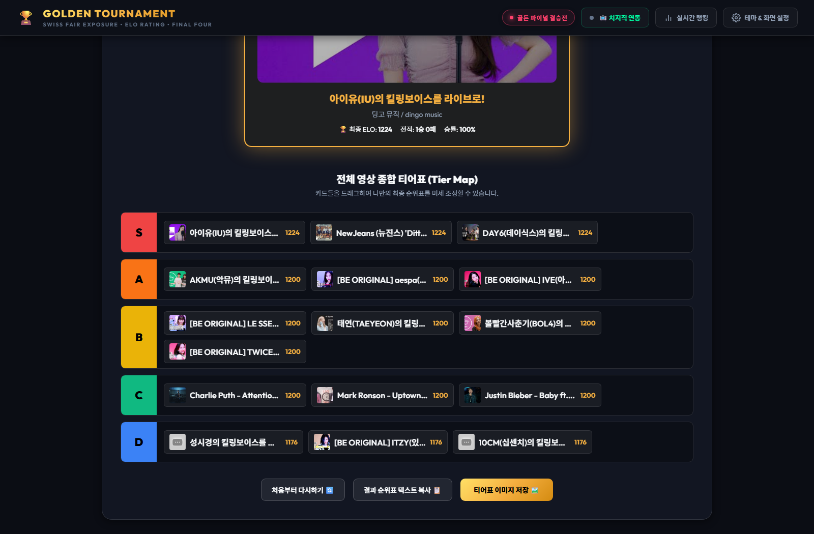

- 최종 순위에 따라 **S, A, B, C, D** 등급 행에 후보 영상 카드가 자동 배치됩니다.
- **인터랙티브 드래그앤드롭**: 마우스로 카드를 끌어다 다른 등급 행으로 옮기거나 순서를 미세 조정하여 나만의 이상적인 최종 티어표를 완성할 수 있습니다.

---

### 6.3 결과 순위표 텍스트 복사 및 고화질 PNG 이미지 다운로드

하단의 3개 액션 버튼을 통해 결과를 다양하게 보존하고 공유할 수 있습니다:
1. `처음부터 다시하기 🔄`: 새로운 토너먼트를 처음부터 다시 시작합니다.
2. `결과 순위표 텍스트 복사 📋`: 커뮤니티, 카페, 디스코드에 공유할 수 있는 마크다운 순위표 텍스트를 원클릭으로 클립보드에 복사합니다.
3. `티어표 이미지 저장 🖼️`: HTML5 Canvas 엔진을 구동하여 티어표 전체를 **워터마크가 포함된 고화질 PNG 이미지 파일(`golden-tournament-tier.png`)**로 즉시 렌더링하여 다운로드합니다.

---

## 7. 스트리머 특화 기능 및 성능 최적화

### ⚡ 자동 세션 저장 및 원클릭 복구 (Auto Save & Resume)
진행 도중 새로고침을 누르거나 웹 브라우저를 닫아도, 현재 매치 번호와 각 후보의 ELO 점수, 4강 브래킷 상태가 브라우저 로컬 저장소(`localStorage`)에 항시 자동 저장됩니다. 브라우저를 다시 열면 상단 배너를 통해 **언제든 1초 만에 이전 진행 상태를 완벽 복원**할 수 있습니다.

### 🚀 Zero-Lag 60FPS 최적화
유튜브 플레이어 iframe을 매 라운드 생성/파괴하지 않고, 좌/우 2개의 플레이어 인스턴스를 영구 재활용(Instance Reuse)합니다. 가비지 컬렉터(GC) 스파이크를 원천 방지하여 방송 송출 프로그램(OBS, XSplit) 동시 구동 시에도 컴퓨터 리소스를 최소한으로 점유합니다.
